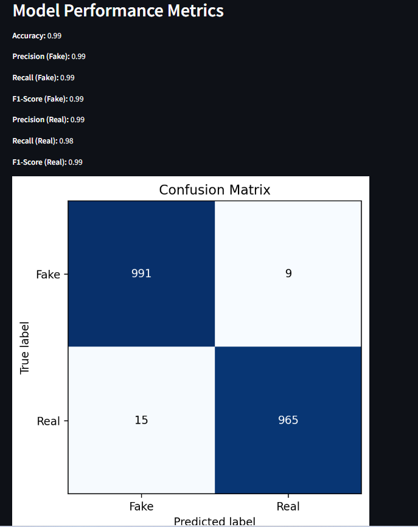
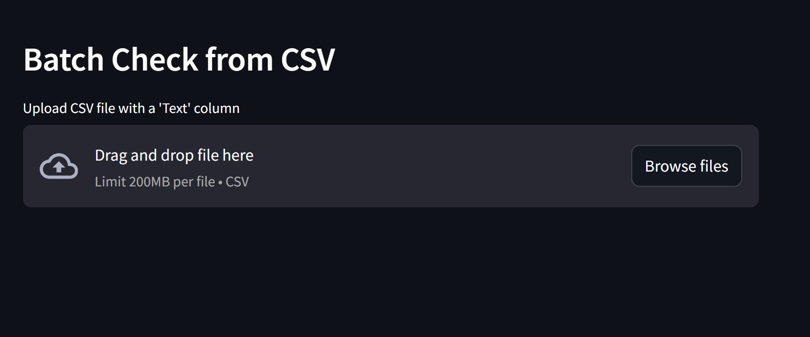

# Fake News Detector

A simple and interactive **Fake News Detector** web app built with **Streamlit** and **Machine Learning**.

## Features

- Predict if a news headline is **Fake** or **Real** with confidence score.
- Visual confidence bar with intuitive color coding.
- Explanation of top words influencing the prediction.
- Upload CSV files for batch predictions.
- User feedback collection to improve model accuracy.
- Display of model performance metrics and confusion matrix.

## Tech Stack

- Python, Streamlit
- scikit-learn (Logistic Regression model)
- pandas, numpy
- matplotlib (for confusion matrix visualization)

## Getting Started

1. Clone the repo:

git clone https://github.com/YOUR-USERNAME/YOUR-REPO.git
cd YOUR-REPO

2. Install dependencies:

pip install -r requirements.txt

3. Run the app:

streamlit run app.py

## Sample CSV for batch testing

Use CSV with a column named `Text`, e.g.:

Text
"COVID-19 vaccines are effective"
"Elections were rigged"

## Screenshots

